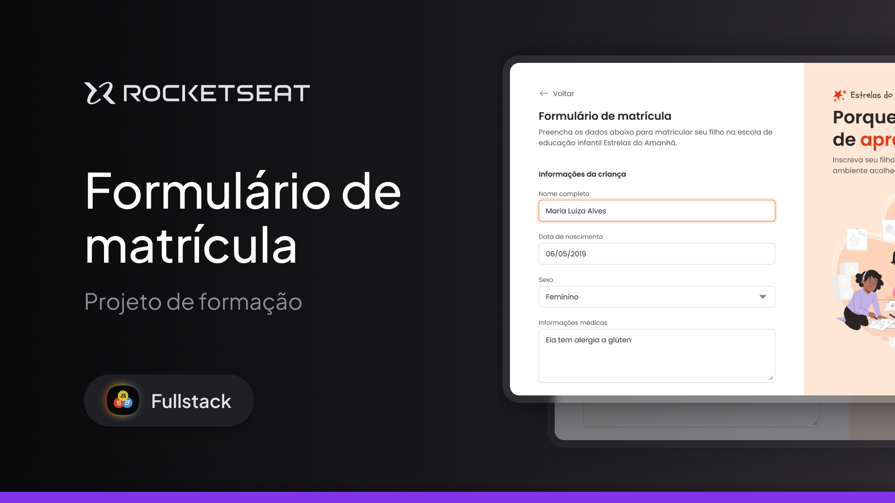

## Formulário de matrícula

  

## 🖥️ Sobre o Projeto

Neste repositório está hospedado um layout inspirador e responsivo de formulário completo para matricular alunos à uma instiyuição de ensino fundamental.

## 🚧 Status

Atualmente o layout do projeto encontra-se no estado de finalizado, deixando margem apenas para um futuro upgrade com integração de backend e conexão com bancos de dados.

## 🍪 Acesso ao Projeto

Este projeto pode ser visualizado através deste [link](https://ppedrolucas.github.io/Formul-rio-de-Matr-cula/).

## 🚀 Tecnologias

As seguintes ferramentas foram usadas para o desenvolvimento do projeto:

  

Feito com ❤️ por Pedro Lucas 👋🏽
